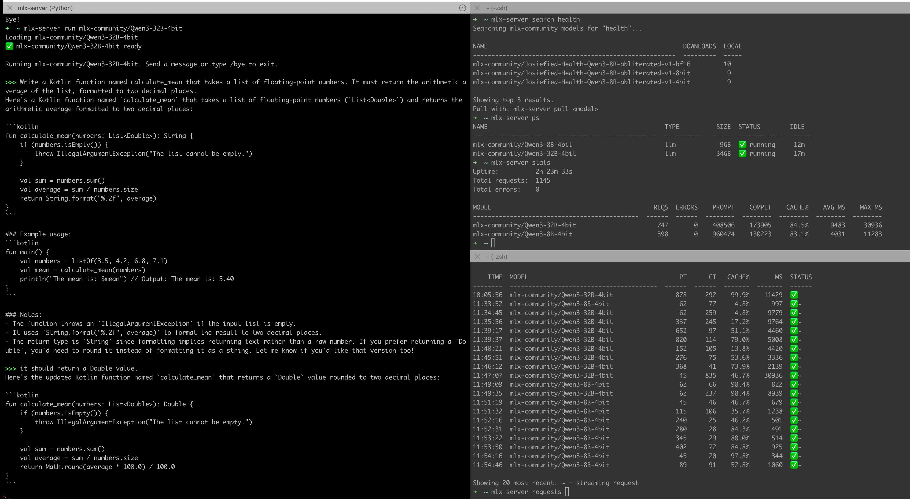

# mlx-server

An Ollama-style CLI for running LLMs locally on Apple Silicon via [MLX](https://github.com/ml-explore/mlx).

**One URL, many models.** A single gateway routes OpenAI-compatible API requests to the right model backend — just like calling `api.openai.com`, but everything runs on your Mac.

## Requirements

- All Apple Silicon Macs
- Python 3.10+
- `mlx-lm`: `pipx install mlx-lm`

## Installation

```bash
git clone git@github.com:dsilahcilar/mlx-server.git
cd mlx-server
./install.sh
```

## Quick Start

```bash
# Start the gateway server
mlx-server serve

# Pull and run a model (starts interactive chat)
mlx-server run mlx-community/Qwen3-32B-4bit

# From another terminal — use the API
curl http://127.0.0.1:11070/v1/chat/completions \
  -H "Content-Type: application/json" \
  -d '{"model":"mlx-community/Qwen3-32B-4bit","messages":[{"role":"user","content":"Hello"}]}'
```

## Commands

| Command | Description |
|---|---|
| `serve [--port N]` | Start the gateway server (default port: 11070) |
| `shutdown` | Stop the gateway and all loaded models |
| `run <model>` | Load a model and start interactive chat |
| `stop <model>` | Unload a model from memory |
| `pull <model>` | Download a model from HuggingFace |
| `rm <model>` | Delete a downloaded model |
| `show <model>` | Show model details (architecture, size, quantization) |
| `ps` | List currently loaded models |
| `list` | List locally downloaded models |
| `search [query]` | Search mlx-community models on HuggingFace |
| `logs [-f]` | View gateway logs |
| `stats` | Show request metrics (totals, per-model, latency) |
| `requests [--tail N]` | Show recent request log entries |

## Multi-Model Support

Load multiple models simultaneously — the gateway routes by the `model` field:

```bash
mlx-server serve

# Load both models (each gets its own backend process)
mlx-server run mlx-community/Qwen3-32B-4bit    # loads on demand
mlx-server run mlx-community/Qwen3-8B-4bit     # loads alongside

# API calls routed by model name — same URL
curl http://127.0.0.1:11070/v1/chat/completions \
  -d '{"model":"mlx-community/Qwen3-32B-4bit","messages":[...]}'

curl http://127.0.0.1:11070/v1/chat/completions \
  -d '{"model":"mlx-community/Qwen3-8B-4bit","messages":[...]}'

# Check what's loaded
mlx-server ps

# Unload one
mlx-server stop mlx-community/Qwen3-8B-4bit
```

Models are also loaded **on demand**: just send an API request with any locally available model and the gateway starts the backend automatically.

## OpenAI-Compatible API

The gateway implements the OpenAI API standard:

| Endpoint | Method | Description |
|---|---|---|
| `/v1/chat/completions` | POST | Chat completions (streaming + non-streaming) |
| `/v1/completions` | POST | Text completions |
| `/v1/embeddings` | POST | Embeddings |
| `/v1/models` | GET | List available models |

Works with any OpenAI client:

```python
from openai import OpenAI
client = OpenAI(base_url="http://127.0.0.1:11070/v1", api_key="mlx")
response = client.chat.completions.create(
    model="mlx-community/Qwen3-32B-4bit",
    messages=[{"role": "user", "content": "Hello!"}]
)
```

```typescript
import OpenAI from "openai";
const client = new OpenAI({ baseURL: "http://127.0.0.1:11070/v1", apiKey: "mlx" });
```

Also works with LangChain, Spring AI, Cursor, Continue.dev, and any tool that supports custom OpenAI base URLs.

## Admin & Observability API

Internal endpoints for monitoring and lifecycle management:

| Endpoint | Method | Description |
|---|---|---|
| `/_/health` | GET | Liveness check — returns `{"status":"ok"}` |
| `/_/ps` | GET | List loaded model backends with status, PID, idle time |
| `/_/metrics` | GET | Aggregated stats: uptime, total requests/errors, per-model token counts and latency |
| `/_/requests?n=N` | GET | Last *N* request log entries (default 50, max 1000) |
| `/_/load` | POST | Pre-load a model (`{"model":"<id>"}`) |
| `/_/unload` | POST | Unload a model from memory (`{"model":"<id>"}`) |

### `/_/metrics` response

```json
{
  "uptime_seconds": 3600,
  "total_requests": 142,
  "total_errors": 1,
  "models": {
    "mlx-community/Qwen3-8B-4bit": {
      "requests": 142,
      "errors": 1,
      "prompt_tokens": 18400,
      "completion_tokens": 9200,
      "cached_tokens": 0,
      "latency_avg_ms": 312.5,
      "latency_min_ms": 98.2,
      "latency_max_ms": 1840.0
    }
  }
}
```

### `/_/requests?n=N` response

```json
{
  "requests": [
    {
      "ts": "2025-01-01T12:00:00+00:00",
      "model": "mlx-community/Qwen3-8B-4bit",
      "endpoint": "/v1/chat/completions",
      "stream": true,
      "latency_ms": 312.5,
      "prompt_tokens": 128,
      "completion_tokens": 64,
      "cached_tokens": 0,
      "error": false
    }
  ]
}
```

### CLI shortcuts

```bash
# Live metrics summary
mlx-server stats

# Last 20 requests
mlx-server requests --tail 20

# Health check
curl http://127.0.0.1:11070/_/health
```

## Ollama-Compatible API

Drop-in replacement for tools that speak Ollama's wire format:

| Endpoint | Method | Description |
|---|---|---|
| `/api/tags` | GET | List locally available models |
| `/api/ps` | GET | List loaded models |
| `/api/version` | GET | Version string |
| `/api/chat` | POST | Chat (streaming NDJSON + non-streaming) |
| `/api/generate` | POST | Text generation |
| `/api/show` | POST | Model info |

## Model Aliases

The gateway auto-generates short aliases from cached model names:

| Full HuggingFace ID | Short alias | Ollama alias |
|---|---|---|
| `mlx-community/Qwen3-8B-4bit` | `Qwen3-8B-4bit` | `qwen3:8b` |
| `mlx-community/Qwen3-32B-4bit` | `Qwen3-32B-4bit` | `qwen3:32b` |

Custom aliases can be added to `~/.mlx/aliases.json`:
```json
{
  "my-model": "mlx-community/Qwen3-8B-4bit"
}
```

## Environment Variables

| Variable | Default | Description |
|---|---|---|
| `MLX_PORT` | `11070` | Gateway listen port |
| `HF_HOME` | `~/.cache/huggingface` | HuggingFace cache root |

## Architecture

```
┌─────────────┐
│   Clients    │  (curl, Python SDK, Spring AI, etc.)
└──────┬───────┘
       │ :11070
┌──────▼───────┐
│   Gateway    │  Single entry point, routes by "model" field
│  (Python)    │
└──┬───────┬───┘
   │       │
┌──▼──┐ ┌──▼──┐
│ :181│ │ :181│  Internal mlx_lm.server backends
│ 00  │ │ 01  │  (one per model, auto-managed)
│Qwen │ │Qwen │
│ 32B │ │  8B │
└─────┘ └─────┘
```

### Package layout

```
mlx_server/
├── config.py             # constants and path configuration
├── metrics.py            # ModelMetrics + MetricsCollector
├── models.py             # model cache helpers, binary discovery
├── aliases.py            # Ollama-style alias generation and resolution
├── backend.py            # ModelBackend + BackendManager
├── embedding_server.py   # standalone embedding subprocess server
├── gateway.py            # GatewayHandler + ThreadedServer + serve()
├── chat.py               # interactive chat REPL
└── handlers/
    ├── base.py           # shared HTTP utilities mixin
    ├── openai.py         # /v1/* handler mixin
    └── ollama.py         # /api/* handler mixin
```

## Notes

- State tracked in `~/.mlx/` (gateway PID, backend logs, request log)
- Models cached in `~/.cache/huggingface/hub/`
- Backends start with `HF_HUB_OFFLINE=1` for instant loading from cache
- Chain-of-thought (thinking) disabled by default for cleaner output
- Max tokens default: 4096 per response
- Request log persisted to `~/.mlx/requests.jsonl` (last 1000 entries kept in memory)

## CLI Usage


